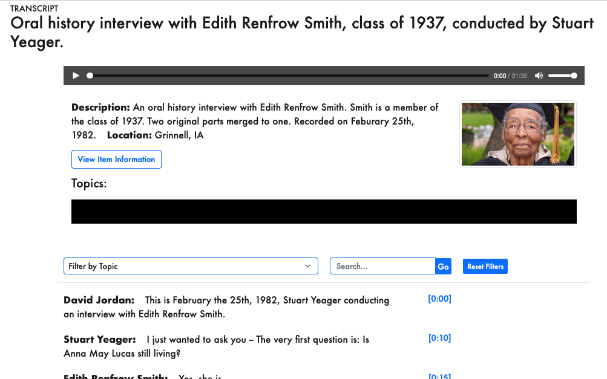
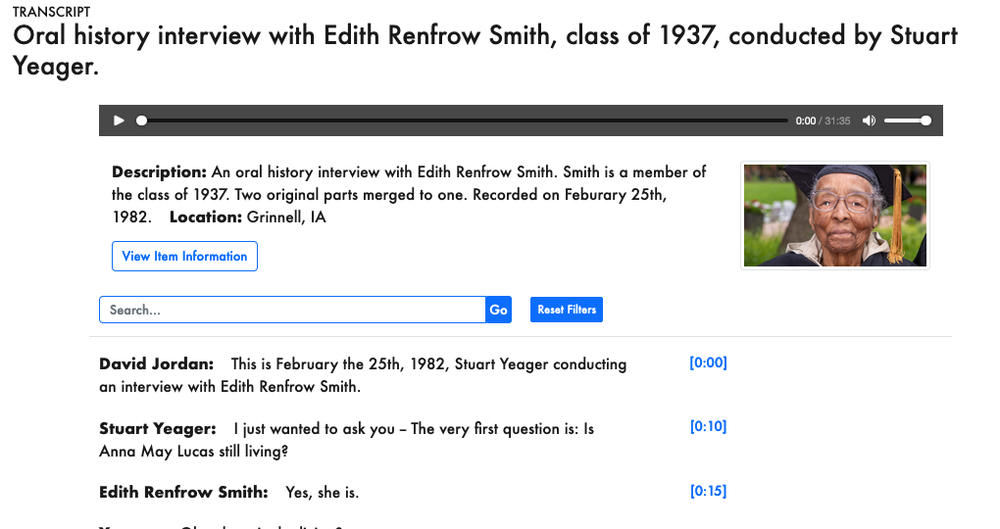

# Yeager-Renfrow Oral Histories

This repo was constructed from a [cb-oralhistory](https://github.com/Digital-Grinnell/cb-oralhistory) fork of the original https://github.com/CollectionBuilder/cb-oralhistory project COMBINED with elements of [CollectionBuilder base repo](https://github.com/Digital-Grinnell/grinnell-college-base-CB) (with Grinnell College specifics) that was itself derived from a CB experiment housed in https://github.com/Digital-Grinnell/black-library-CB-CSV-experiment.  

The documentation below the [cb-oralhistory](#cb-oralhistory) and [CollectionBuilder-CSV](#collectionbuilder-csv) headings are specifc to the original repos and preserved here for reference only.  

## Yeager-Renfrow Oral Histories Resources

| Link | Description |  
| ---  | ---         |  
| https://docs.google.com/spreadsheets/d/1z2W5L8JVdNcqaPdNZyXAThw2wnf7TSUK2Y2giO9i6NM/edit?gid=663101020#gid=663101020 | The project's public metadata spreadsheet. |
| | `main` branch deployed to Azure Static Web Apps |  
| https://docs.google.com/spreadsheets/d/1z2W5L8JVdNcqaPdNZyXAThw2wnf7TSUK2Y2giO9i6NM/edit?gid=823757564#gid=823757564 | "From the Documentation" portion of our Google Sheet | 
| | OneDrive folder |

## Building as an Azure Static Web App

Following the guidance provided in [Deploy your web app](https://learn.microsoft.com/en-us/azure/static-web-apps/publish-jekyll#deploy-your-web-app)...  

I choose the `jekyll` build option rather than `Custom` and got this workflow file...  

```yml
name: Azure Static Web Apps CI/CD

on:
  push:
    branches:
      - main
  pull_request:
    types: [opened, synchronize, reopened, closed]
    branches:
      - main

jobs:
  build_and_deploy_job:
    if: github.event_name == 'push' || (github.event_name == 'pull_request' && github.event.action != 'closed')
    runs-on: ubuntu-latest
    name: Build and Deploy Job
    steps:
      - uses: actions/checkout@v3
        with:
          submodules: true
          lfs: false
      - name: Build And Deploy
        id: builddeploy
        uses: Azure/static-web-apps-deploy@v1
        with:
          azure_static_web_apps_api_token: ${{ secrets.AZURE_STATIC_WEB_APPS_API_TOKEN_<GENERATED_HOSTNAME> }}
          repo_token: ${{ secrets.GITHUB_TOKEN }} # Used for Github integrations (i.e. PR comments)
          action: "upload"
          ###### Repository/Build Configurations - These values can be configured to match your app requirements. ######
          # For more information regarding Static Web App workflow configurations, please visit: https://aka.ms/swaworkflowconfig
          app_location: "/" # App source code path
          api_location: "" # Api source code path - optional
          output_location: "_site" # Built app content directory - optional
          ###### End of Repository/Build Configurations ######

  close_pull_request_job:
    if: github.event_name == 'pull_request' && github.event.action == 'closed'
    runs-on: ubuntu-latest
    name: Close Pull Request Job
    steps:
      - name: Close Pull Request
        id: closepullrequest
        uses: Azure/static-web-apps-deploy@v1
        with:
          azure_static_web_apps_api_token: ${{ secrets.AZURE_STATIC_WEB_APPS_API_TOKEN_<GENERATED_HOSTNAME> }}
          action: "close"
```

Following the aforementioned procedure eventually produced the site https://lemon-desert-0d74b4810.5.azurestaticapps.net.  

This workflow uses GitHub Actions to deploy and you can see the status of deployment at https://github.com/Digital-Grinnell/yeager-renfrow-oral-histories/actions.  


## Set Up a Custom Domain in Azure Static Web Apps

Followed the procedure documented in https://learn.microsoft.com/en-us/azure/static-web-apps/custom-domain-external AFTER Mike C. setup the necessary CNAME record in the `grinnell.edu` domain in order to link this site to https://yeager-collection.grinnell.edu.  

# Filters

The presence of a `_data/filters.csv` file causes CB to display the "Topics:" and "Filter by Topic" elements you see below.  



Removing that configuration file produces a display without those elements as you see below.



# Timeline and Time-Span

The CB documentation talks about [Editing the Home Page](https://collectionbuilder.github.io/cb-docs/docs/pages/home/#editing-the-home-page) including a sub-topic to [Delete a Home Page Feature](https://collectionbuilder.github.io/cb-docs/docs/pages/home/#delete-a-home-page-feature).  

Since our data has no meaningful timeline elements (dates) we've elected to remove it by commenting out the `` statement in the `_layouts/home-infographic.html` file.

# Suppressing Pages

The original `config-nav.csv` file looked something like this:

```
display_name,stub,dropdown_parent
Home,/,
Browse,/browse.html,
Visualization,/ohdviz.html
Subjects,/subjects.html,
Locations,/locations.html,
Map,/map.html,
Timeline,/timeline.html,
Data,/data.html,
About,/about.html,
```

For this project we wanted to suppress the `Visualization`, `Map` and `Timeline` pages so the file was modified to include only this configuration:

```
display_name,stub,dropdown_parent
Home,/,
Browse,/browse.html,
Subjects,/subjects.html,
Locations,/locations.html,
Data,/data.html,
About,/about.html,
```

# People

Our initial "People" cloud tag was dominated by the interviewer, "Stuart Yeager", and I didn't want to remove his name from every interview transcript.  Fortunately Libby directed me to look deeper and I found https://collectionbuilder.github.io/cb-docs/docs/advanced/cloudpage/#create-a-new-cloud-page-using-cloud-layout-and-front-matter in the documentation and introduced the name of our interviewer as a cloud-stopwords frontmatter element in `pages/people.md` and it works nicely!

The new line in the frontmatter is:

```
cloud-stopwords: yeager, stuart;
```

# Subjects

Like our "People" page, our initial "Subjects" cloud tag was dominated by a single common phrase but we didn't want to remove it from line of the metadata CSV.  So, as with "People" I used https://collectionbuilder.github.io/cb-docs/docs/advanced/cloudpage/#create-a-new-cloud-page-using-cloud-layout-and-front-matter in the documentation and introduced `cloud-stopwords` frontmatter in `pages/subjects.md` and it works nicely!  To make this work I also had to change the `cloud-fields:` element of the frontmatter.  

The new frontmatter is:

```
---
title: Subjects
layout: cloud
permalink: /subjects.html
# Default subject page is configured in "_data/theme.yml"
cloud-fields: subject
cloud-stopwords: black experience at grinnell college;
# Leave cloud-fields as "site.data.theme.subjects-fields", but stopwords did NOT work until cloud-fields was changed?
#   cloud-fields: site.data.theme.subjects-fields
---
```

# cb-oralhistory

**cb-oralhistory** is a mix of [CollectionBuilder-CSV](https://github.com/CollectionBuilder/collectionbuilder-csv) and [Oral History as Data (OHD)](https://github.com/oralhistoryasdata/oralhistoryasdata.github.io). It's meant to serve as a starter repository for those wanting to build oral history collections with CollectionBuilder. 

The current demo site features a small mix of transcripts. Item pages are generated by a CSV metadata file that includes the display_template "transcript" as a field. 


## About Oral History as Data
Oral History as Data (OHD) provides a static web framework for users to publish and analyze coded oral history and qualitative interviews on the web. 

Oral History as Data was first built in 2018, coming out of work at the University of Idaho Library's [Center for Digital Inquiry and Learning (CD?L)](https://cdil.lib.uidaho.edu/). 
The framework served as the foundation for several digital humanities projects, including [Voices of Gay Rodeo](https://www.voicesofgayrodeo.com/), [Idaho Queered](https://www.lib.uidaho.edu/queered/), and [CTRL+Shift](https://ctrl-shift.org/). 

The look for OHD is different than CollectionBuilder. Check out the [a demo site](https://oralhistoryasdata.github.io/) to see the differences.

There is some [documentation](https://oralhistoryasdata.github.io/about.html#documentation) for OHD that might be helpful in this context. More fully developed documentation for this project is being developed, but there are several places linked here to get you started.

## About CollectionBuilder-CSV

CollectionBuilder-CSV is a robust and flexible "stand alone" template for creating digital collection and exhibit websites using Jekyll and a metadata CSV.
Driven by your collection metadata, the template generates engaging visualizations to browse and explore your objects.
The resulting static site can be hosted on any basic web server (or built automatically using GitHub Actions).

Visit the [CollectionBuilder Docs](https://collectionbuilder.github.io/cb-docs/) for step-by-step details for getting started and building collections!

## Brief Overview of Building a Collection

The [CollectionBuilder Docs](https://collectionbuilder.github.io/cb-docs/) contain detailed information about building a collection from start to finish--including installing software, using Git/GitHub, preparing digital objects, and formatting metadata.
However, here is a super quick overview of the process:

- Make your own copy of this template repository by clicking the green "Use this Template" button on GitHub (see [repository set up docs](https://collectionbuilder.github.io/cb-docs/docs/repository/)). This copy of the template is the starting point for your "project repository", i.e. the source code for your digital collection site!
- Prepare your collection metadata following the CB-CSV template (see our demo [metadata template on Google Sheets](https://docs.google.com/spreadsheets/d/1nN_k4JQB4LJraIzns7WcM3OXK-xxGMQhW1shMssflNM/edit?usp=sharing) and [metadata docs](https://collectionbuilder.github.io/cb-docs/docs/metadata/csv_metadata/)). Your metadata will include links to your digital files (images, pdfs, videos, etc) and thumbnails wherever they are hosted.
- Add your metadata as a CSV to your project repository's "_data" folder (see [upload metadata docs](https://collectionbuilder.github.io/cb-docs/docs/metadata/uploading/)).
- Edit your project's "_config.yml" with your collection information (see [site configuration docs](https://collectionbuilder.github.io/cb-docs/docs/config/)). Additional customization is done via a theme file, configuration files, CSS tweaks, and more--however, once your "_config.yml" is edited your site is ready to be previewed. 
- Generate your site using Jekyll! (see docs for how to [use Jekyll locally](https://collectionbuilder.github.io/cb-docs/docs/repository/generate/) and [deploy on the web](https://collectionbuilder.github.io/cb-docs/docs/deploy/))

Please feel free to ask questions in the main [CollectionBuilder discussion forum](https://github.com/CollectionBuilder/collectionbuilder.github.io/discussions).       

----------

## CollectionBuilder 

<https://collectionbuilder.github.io/>

CollectionBuilder is a project of University of Idaho Library's [Digital Initiatives](https://www.lib.uidaho.edu/digital/) and the [Center for Digital Inquiry and Learning](https://cdil.lib.uidaho.edu) (CDIL) following the [Lib-Static](https://lib-static.github.io/) methodology. 
Powered by the open source static site generator [Jekyll](https://jekyllrb.com/) and a modern static web stack, it puts collection metadata to work building beautiful sites.

The basic theme is created using [Bootstrap](https://getbootstrap.com/).
Metadata visualizations are built using open source libraries such as [DataTables](https://datatables.net/), [Leafletjs](http://leafletjs.com/), [Spotlight gallery](https://github.com/nextapps-de/spotlight), [lazysizes](https://github.com/aFarkas/lazysizes), and [Lunr.js](https://lunrjs.com/).
Object metadata is exposed using [Schema.org](http://schema.org) and [Open Graph protocol](http://ogp.me/) standards.

Questions can be directed to **collectionbuilder.team@gmail.com**

## License

CollectionBuilder documentation and general web content is licensed [Creative Commons Attribution-ShareAlike 4.0 International](http://creativecommons.org/licenses/by-sa/4.0/). 
This license does *NOT* include any objects or images used in digital collections, which may have individually applied licenses described by a "rights" field.
CollectionBuilder code is licensed [MIT](https://github.com/CollectionBuilder/collectionbuilder-csv/blob/master/LICENSE). 
This license does not include external dependencies included in the `assets/lib` directory, which are covered by their individual licenses.


# Black Library Project Resources
|https://grinco-my.sharepoint.com/:f:/r/personal/caveelizabeth_grinnell_edu/Documents/Black%20Library%20items?csf=1&web=1&e=7e6prh| OneDrive folder |

| Link | Description |  
| ---  | ---         |  
| https://docs.google.com/spreadsheets/d/17uNXLP5aTSCfYZ8FXBqTvDd-z0F19FJeAOK5TsCr-PI/edit | The project's public metadata spreadsheet, built from https://docs.google.com/spreadsheets/d/1nN_k4JQB4LJraIzns7WcM3OXK-xxGMQhW1shMssflNM/edit#gid=1973435486 and our SHEETS predecessor. |
| https://zealous-rock-08144ee10.4.azurestaticapps.net | `main` branch deployed to Azure Static Web Apps |  
| https://docs.google.com/spreadsheets/d/17uNXLP5aTSCfYZ8FXBqTvDd-z0F19FJeAOK5TsCr-PI/edit#gid=823757564 | "From the Documentation" portion of our Google Sheet | 
| https://grinco-my.sharepoint.com/:f:/r/personal/caveelizabeth_grinnell_edu/Documents/Black%20Library%20items?csf=1&web=1&e=7e6prh | OneDrive folder |

----------

## Running Locally

```zsh
bundle exec jekyll serve
```

## `objectid` Convention

`grinnell_<index>` denotes a legacy object imported from _Digital.Grinnell_.  
`dg_<epoch>` denotes a new object NOT imported from _Digital.Grinnell_.  `<epoch>` is a simple 10-digit UNIX epoch time generated when the object is cataloged. 

## Building as an Azure Static Web App

Following the guidance provided in [Deploy your web app](https://learn.microsoft.com/en-us/azure/static-web-apps/publish-jekyll#deploy-your-web-app)...  

I choose the `jekyll` build option rather than `Custom` and got this workflow file...  

```yml
name: Azure Static Web Apps CI/CD

on:
  push:
    branches:
      - main
  pull_request:
    types: [opened, synchronize, reopened, closed]
    branches:
      - main

jobs:
  build_and_deploy_job:
    if: github.event_name == 'push' || (github.event_name == 'pull_request' && github.event.action != 'closed')
    runs-on: ubuntu-latest
    name: Build and Deploy Job
    steps:
      - uses: actions/checkout@v3
        with:
          submodules: true
          lfs: false
      - name: Build And Deploy
        id: builddeploy
        uses: Azure/static-web-apps-deploy@v1
        with:
          azure_static_web_apps_api_token: ${{ secrets.AZURE_STATIC_WEB_APPS_API_TOKEN_<GENERATED_HOSTNAME> }}
          repo_token: ${{ secrets.GITHUB_TOKEN }} # Used for Github integrations (i.e. PR comments)
          action: "upload"
          ###### Repository/Build Configurations - These values can be configured to match your app requirements. ######
          # For more information regarding Static Web App workflow configurations, please visit: https://aka.ms/swaworkflowconfig
          app_location: "./" # App source code path
          api_location: "" # Api source code path - optional
          output_location: "_site" # Built app content directory - optional
          ###### End of Repository/Build Configurations ######

  close_pull_request_job:
    if: github.event_name == 'pull_request' && github.event.action == 'closed'
    runs-on: ubuntu-latest
    name: Close Pull Request Job
    steps:
      - name: Close Pull Request
        id: closepullrequest
        uses: Azure/static-web-apps-deploy@v1
        with:
          azure_static_web_apps_api_token: ${{ secrets.AZURE_STATIC_WEB_APPS_API_TOKEN_<GENERATED_HOSTNAME> }}
          action: "close"
```

Following the aforementioned procedure eventually produced the site https://zealous-rock-08144ee10.4.azurestaticapps.net.  

This workflow uses GitHub Actions to deploy and you can see the status of deployment at https://github.com/Digital-Grinnell/black-library-CB-CSV-experiment/actions?query=workflow%3A%22Azure%20Static%20Web%20Apps%20CI%2FCD%22%20branch%3Amain.  
